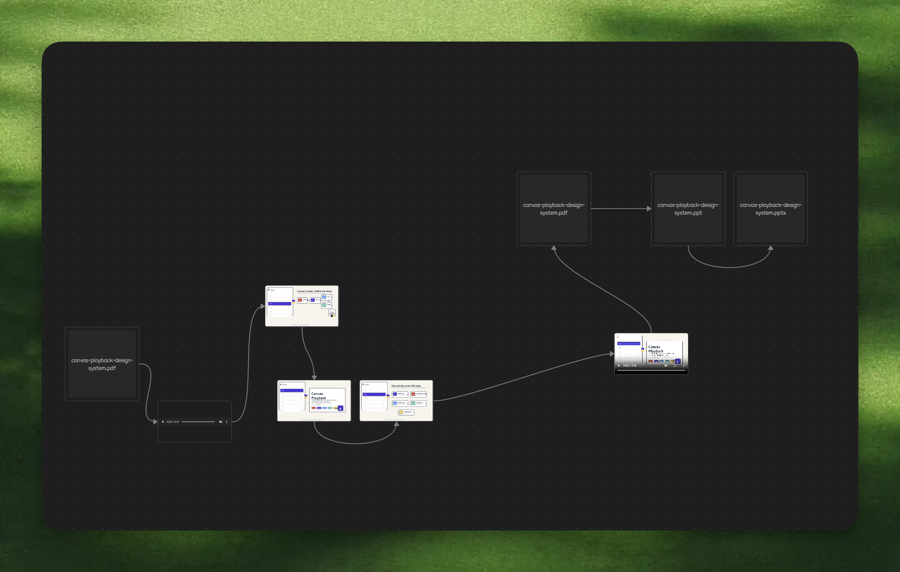
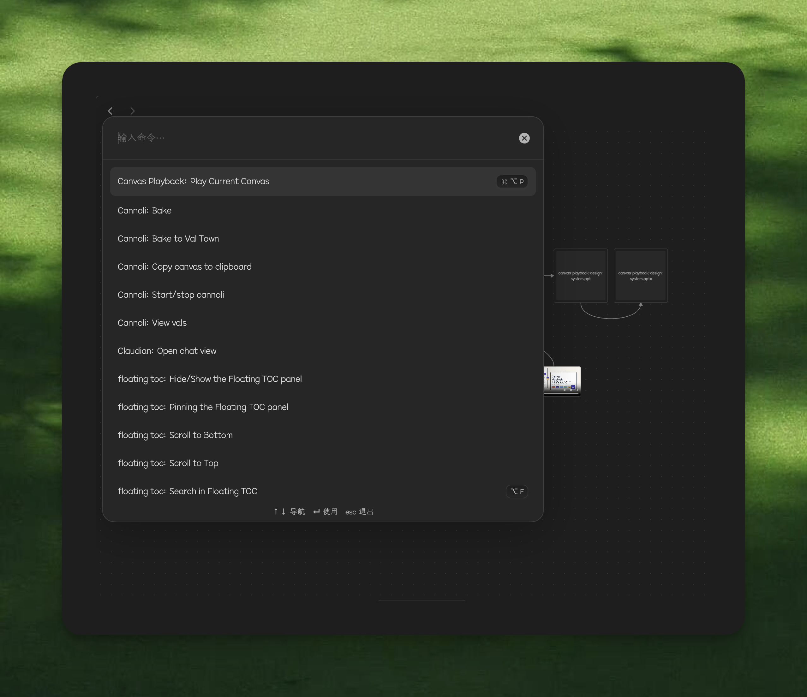
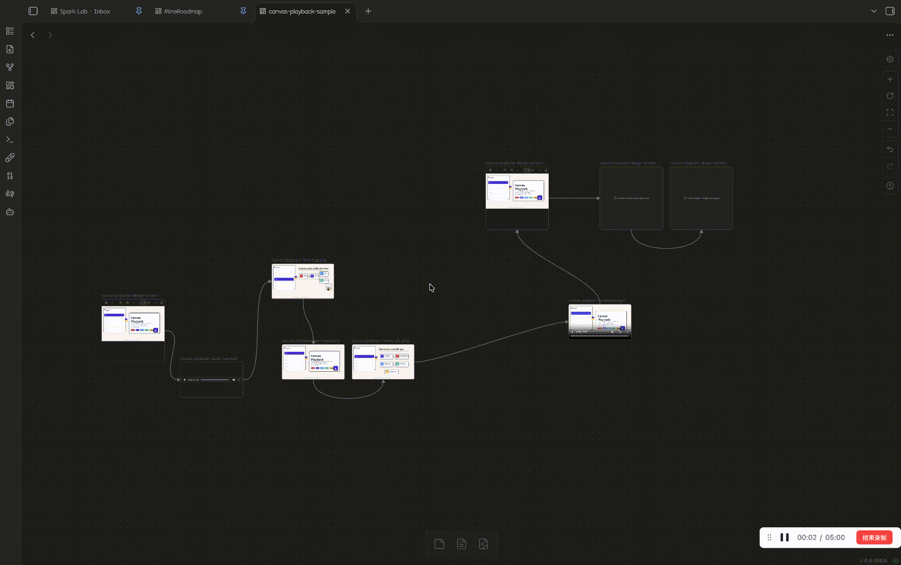

# Canvas Playback

在 Obsidian Canvas 里连接 PDF、PPT、视频、图片、网页和笔记，然后按路径顺序全屏播放。

Play connected PDFs, slide decks, videos, images, web pages, and notes from your Obsidian Canvas as a fullscreen presentation.

**Connect files. Play the flow.**







工作的时候，我经常要在投屏电视上连续播放很多个不同格式、不同来源的 PPT 类文件。在文件之间切换软件很难受，直接用 Apple 的 preview 播放又经常不可控，有时候不全屏，有时候不完整。我很喜欢飞书的内置放映功能，所以常常把十几个文件发给飞书里的自己，再在对话框里依次点击各个文件。但显得我很忙乱，而且很不优雅！

后来我想到，Canvas 本来就是极好的放映控制台。我可以用箭头随时指向和更改播放顺序，他像一个观察者的控制台一样，好像是更高维度来控制电脑（所以我贼喜欢 canva 和 heptabase 、affine 类）；我的生活又已经和本地 Agent 融在一起，Obsidian 是我最常用的软件之一。所以我想，可以做 Canvas Playback。和我预料得差不多，它很优雅。

At work, I often need to play many PowerPoint-like files on a TV, one after another: different formats, different sources. Switching between apps is painful. Playing directly with Apple's Preview is often uncontrollable; sometimes it is not fullscreen, sometimes it is incomplete. I really like Feishu's built-in presentation feature, so I often send a dozen files to myself in Feishu, then click through them one by one in the chat. But it makes me look busy and very inelegant!

Then I realized that Canvas is already an excellent presentation console. I can use arrows to point to files and change the playback order at any time. It feels like an observer's console, as if I am controlling the computer from a higher dimension (which is why I love tools like Canva, Heptabase, and Affine so much). My life is already blended with local agents, and Obsidian is one of the apps I use most. So I thought: I can make Canvas Playback. As I expected, it is elegant.

## 功能

- 按 Canvas 连接线决定播放顺序；有多条连接链时，从最左上方的火车头节点开始，只播放这一条链。
- 无连接线时，按从左到右、从上到下播放。
- PDF 逐页展开为独立播放步骤。
- PPT、PPTX、Keynote、ODP 等演示文件使用同名 PDF 导出逐页播放。
- 支持图片、视频、音频、Markdown、`.deck`、网页链接、Figma 链接和纯文本节点。
- MP3 等音频文件使用适配主视觉的唱片播放器。
- 左侧隐藏式 slide index 可快速跳转，并保持当前播放画面的干净。
- 支持 19 套设计系统。

## Features

- Uses Canvas edges as the playback order; when multiple chains exist, playback starts from the top-left train-head node and only follows that chain.
- Falls back to left-to-right, top-to-bottom order when no edges exist.
- Expands PDFs into individual page steps.
- Plays PowerPoint, Keynote, and ODP files through same-name PDF exports.
- Supports images, videos, audio, Markdown, `.deck`, web links, Figma links, and text nodes.
- Renders audio files with a record-style player matched to the visual system.
- Provides a hidden left-edge slide index for fast navigation without permanent chrome.
- Includes 19 switchable design systems.

## 使用

1. 打开一个 `.canvas` 文件。
2. 运行 `Canvas Playback: Play Current Canvas`，或按 `Cmd+Option+P`。
3. 使用键盘播放：

| 操作 | 快捷键 |
| --- | --- |
| 下一页 | `Space`, `ArrowRight`, `ArrowDown`, `PageDown` |
| 上一页 | `Shift+Space`, `ArrowLeft`, `ArrowUp`, `PageUp` |
| 第一页 | `Home` |
| 最后一页 | `End` |
| 切换全屏 | `F` |
| 退出全屏，再关闭播放器 | `Esc` |

## Usage

1. Open a `.canvas` file.
2. Run `Canvas Playback: Play Current Canvas`, or press `Cmd+Option+P`.
3. Present with the keyboard:

| Action | Shortcut |
| --- | --- |
| Next | `Space`, `ArrowRight`, `ArrowDown`, `PageDown` |
| Previous | `Shift+Space`, `ArrowLeft`, `ArrowUp`, `PageUp` |
| First | `Home` |
| Last | `End` |
| Toggle fullscreen | `F` |
| Exit fullscreen, then close | `Esc` |

## 媒体支持

图片：`png`, `jpg`, `jpeg`, `webp`, `gif`, `svg`, `avif`, `bmp`

视频：`mp4`, `mov`, `m4v`, `webm`, `ogv`, `avi`, `mkv`

音频：`mp3`, `m4a`, `aac`, `wav`, `ogg`, `opus`, `flac`

笔记与文本：`md`, `markdown`, `deck`

Figma：支持 Canvas 链接节点里的 `figma.com/design`、`figma.com/board`、`figma.com/proto`、`figma.com/slides`、`figma.com/deck`，也支持从 Markdown 笔记和 Canvas 文字卡片中自动识别第一个 Figma 链接。

## Media Support

Images: `png`, `jpg`, `jpeg`, `webp`, `gif`, `svg`, `avif`, `bmp`

Videos: `mp4`, `mov`, `m4v`, `webm`, `ogv`, `avi`, `mkv`

Audio: `mp3`, `m4a`, `aac`, `wav`, `ogg`, `opus`, `flac`

Notes and text: `md`, `markdown`, `deck`

Figma: supports `figma.com/design`, `figma.com/board`, `figma.com/proto`, `figma.com/slides`, and `figma.com/deck` from Canvas link nodes, and automatically detects the first Figma link inside a Markdown note or Canvas text card.

## 安装

从 GitHub Release 下载 `main.js`、`manifest.json`、`styles.css`、`design-systems.js` 和 `vendor/pdfjs/`，放入：

```text
<Vault>/.obsidian/plugins/obsidian-canvas-playback/
```

然后在 Obsidian 的 Community plugins 里启用 `Canvas Playback`。

## Installation

Download `main.js`, `manifest.json`, `styles.css`, `design-systems.js`, and `vendor/pdfjs/` from the GitHub release, then place them in:

```text
<Vault>/.obsidian/plugins/obsidian-canvas-playback/
```

Enable `Canvas Playback` from Obsidian Community plugins.

## 开发

当前仓库保留 Obsidian 可直接加载的发布文件，同时逐步向标准插件工程演进。基础检查：

```bash
npm run check
npm run verify:canvas
```

## Development

The repository keeps Obsidian-loadable release files at the root while moving toward a standard plugin project shape. Basic checks:

```bash
npm run check
npm run verify:canvas
```

## 致谢

- [typeUI](https://github.com/bergside/typeui)：我用 slock 很爽的时候，也发现了这个好看的 Design Skill。
- Codex 5.5：虽然很快，20 分钟就把我的额度烧完了，但它真的很强。尤其是在我 Claude Code 周额度用完的时候，很感谢。
- Obsidian & Logseq：很喜欢。

## Thanks

- [typeUI](https://github.com/bergside/typeui): I found this beautiful Design Skill while happily using slock.
- Codex 5.5: It burned through my quota in about 20 minutes, but it is genuinely strong. I am especially grateful when my Claude Code weekly quota is gone.
- Obsidian & Logseq: I love them.

## License

MIT for the plugin code. Vendored PDF.js files retain their Apache-2.0 license in `vendor/pdfjs/LICENSE`.
